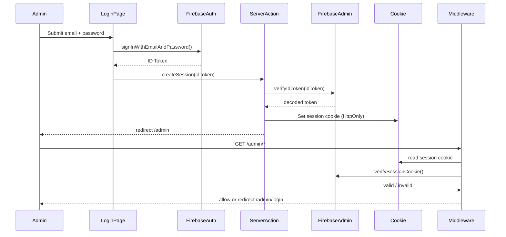

# Design Document: Prateeksha Psychic Coach Website

## Overview

Prateeksha is a full-stack psychic coaching website built on Next.js 16 (App Router) with Firebase as the backend. The site has two public-facing pillars — a blog and a services/coaching section — plus a protected admin dashboard for content management. The design prioritises a minimalist, spiritually evocative aesthetic, strong SEO, and a clean separation between public and admin concerns.

Key technology choices:
- **Next.js 16 App Router** — Server Components by default, Server Actions for mutations, file-based metadata API for SEO
- **Firebase** — Firestore for data persistence, Firebase Auth for admin authentication
- **Tailwind CSS v4** — utility-first styling with a custom design token layer
- **Zod** — server-side form validation
- **React `useActionState`** — client-side form state and error display

## Architecture

```mermaid
graph TD
    subgraph Public Routes
        A[/ Homepage] --> F[Firestore]
        B[/blog] --> F
        C[/blog/slug] --> F
        D[/services] --> F
        E[/contact] --> F
    end

    subgraph Admin Routes
        G[/admin/login] --> H[Firebase Auth]
        I[/admin] --> F
        I --> H
        J[/admin/posts] --> F
        K[/admin/services] --> F
    end

    subgraph Next.js Infrastructure
        L[middleware.ts] --> H
        M[app/sitemap.ts] --> F
        N[app/robots.ts]
    end
```

### Rendering Strategy

| Route | Strategy | Rationale |
|---|---|---|
| `/` | Server Component + ISR | Blog previews and services fetched server-side, revalidated on write |
| `/blog` | Server Component + ISR | Full post list, revalidated on write |
| `/blog/[slug]` | Server Component + ISR | Individual post, revalidated on write |
| `/services` | Server Component + ISR | Services list, revalidated on write |
| `/contact` | Server Component + Client form | Static shell, client form with Server Action |
| `/admin/*` | Server Component + Client forms | Protected, no caching |

### Authentication Flow

Admin authentication uses Firebase Auth client SDK on the login page. After sign-in, a Firebase ID token is exchanged for a session cookie (HttpOnly, Secure, SameSite=Lax) via a Server Action. Next.js middleware verifies this cookie on every `/admin/*` request using the Firebase Admin SDK.



## Components and Interfaces

### File Structure

```
src/
  app/
    layout.tsx                  # Root layout: fonts, nav, footer, WebSite JSON-LD
    page.tsx                    # Homepage
    globals.css                 # Tailwind base + design tokens
    sitemap.ts                  # Dynamic sitemap
    robots.ts                   # robots.txt
    not-found.tsx               # Global 404
    blog/
      page.tsx                  # Blog listing
      [slug]/
        page.tsx                # Individual post
    services/
      page.tsx                  # Services listing
    contact/
      page.tsx                  # Contact page (shell)
    admin/
      layout.tsx                # Admin layout (auth guard)
      login/
        page.tsx                # Login page
      page.tsx                  # Admin dashboard
      posts/
        page.tsx                # Post list
        new/
          page.tsx              # New post editor
        [id]/
          edit/
            page.tsx            # Edit post editor
      services/
        page.tsx                # Service list
        new/
          page.tsx              # New service form
        [id]/
          edit/
            page.tsx            # Edit service form
  lib/
    firebase/
      client.ts                 # Firebase client SDK init
      admin.ts                  # Firebase Admin SDK init (server-only)
    firestore/
      posts.ts                  # Firestore queries for posts
      services.ts               # Firestore queries for services
      contacts.ts               # Firestore write for contact submissions
    session.ts                  # Session cookie create/delete/verify
    slug.ts                     # Slug generation utility
    validations.ts              # Zod schemas
  actions/
    auth.ts                     # login, logout Server Actions
    posts.ts                    # createPost, updatePost, deletePost Server Actions
    services.ts                 # createService, updateService, deleteService Server Actions
    contact.ts                  # submitContact Server Action
  components/
    ui/
      NavBar.tsx
      Footer.tsx
      BlogCard.tsx
      ServiceCard.tsx
      SkeletonCard.tsx
      SubmitButton.tsx          # useFormStatus-aware submit button
    admin/
      PostEditor.tsx            # Rich text editor wrapper (client component)
      ConfirmDelete.tsx         # Delete confirmation dialog
```

### Key Component Interfaces

```typescript
// BlogCard props
interface BlogCardProps {
  title: string
  slug: string
  excerpt: string
  coverImage: string
  publishedAt: Date
  tags: string[]
}

// ServiceCard props
interface ServiceCardProps {
  name: string
  description: string
  duration: string
  price: string
  bookingLink: string
}

// Contact form state (returned by Server Action)
interface ContactFormState {
  errors?: {
    name?: string[]
    email?: string[]
    subject?: string[]
    message?: string[]
  }
  success?: boolean
  serverError?: string
}
```

## Data Models

### Firestore Collections

#### `posts` collection

```typescript
interface BlogPost {
  id: string                  // Firestore document ID
  title: string               // Required
  slug: string                // URL-safe, unique
  excerpt: string
  body: string                // HTML from rich text editor
  coverImage: string          // URL
  tags: string[]
  published: boolean
  publishedAt: Timestamp
  createdAt: Timestamp
  updatedAt: Timestamp
}
```

#### `services` collection

```typescript
interface Service {
  id: string                  // Firestore document ID
  name: string                // Required
  description: string
  duration: string            // e.g. "60 minutes"
  price: string               // e.g. "$150"
  bookingLink: string         // URL or mailto
  active: boolean
  createdAt: Timestamp
  updatedAt: Timestamp
}
```

#### `contacts` collection

```typescript
interface ContactSubmission {
  id: string                  // Firestore document ID
  name: string
  email: string
  subject: string
  message: string
  submittedAt: Timestamp
}
```

### Zod Validation Schemas

```typescript
// Contact form
const ContactSchema = z.object({
  name: z.string().min(1, 'Name is required').trim(),
  email: z.email('Invalid email address').trim(),
  subject: z.string().min(1, 'Subject is required').trim(),
  message: z.string().min(1, 'Message is required').trim(),
})

// Blog post form
const PostSchema = z.object({
  title: z.string().min(1, 'Title is required').trim(),
  slug: z.string().min(1).regex(/^[a-z0-9-]+$/, 'Invalid slug format'),
  excerpt: z.string().trim(),
  coverImage: z.string().url().or(z.literal('')),
  tags: z.array(z.string()),
  body: z.string(),
  published: z.boolean(),
})

// Service form
const ServiceSchema = z.object({
  name: z.string().min(1, 'Name is required').trim(),
  description: z.string().trim(),
  duration: z.string().trim(),
  price: z.string().trim(),
  bookingLink: z.string().trim(),
  active: z.boolean(),
})
```

### Slug Generation

```typescript
// lib/slug.ts
export function generateSlug(title: string): string {
  return title
    .toLowerCase()
    .replace(/[^a-z0-9\s-]/g, '')
    .replace(/\s+/g, '-')
    .replace(/-+/g, '-')
    .trim()
}
```

### SEO Metadata Pattern

Each public page exports either a static `metadata` object or a `generateMetadata` function. The root layout sets `metadataBase` and a title template:

```typescript
// app/layout.tsx
export const metadata: Metadata = {
  metadataBase: new URL(process.env.NEXT_PUBLIC_SITE_URL!),
  title: { template: '%s | Prateeksha', default: 'Prateeksha — Psychic Coach' },
  openGraph: { siteName: 'Prateeksha', type: 'website' },
}
```

Individual blog post pages use `generateMetadata` to pull post data from Firestore and populate dynamic OG/Twitter tags and canonical URLs.

### Cache Invalidation

After every admin write (create/update/delete post or service), the Server Action calls `revalidatePath()` on the affected public routes so ISR pages reflect the change immediately without a full rebuild.

```typescript
// After creating/updating/deleting a post:
revalidatePath('/blog')
revalidatePath(`/blog/${slug}`)
revalidatePath('/')
```


## Correctness Properties

*A property is a characteristic or behavior that should hold true across all valid executions of a system — essentially, a formal statement about what the system should do. Properties serve as the bridge between human-readable specifications and machine-verifiable correctness guarantees.*

### Property 1: Homepage shows the three most recent published posts

*For any* collection of published blog posts, the function that selects homepage preview posts should return exactly the 3 posts with the most recent `publishedAt` timestamps, in descending order.

**Validates: Requirements 1.2**

---

### Property 2: Only active services are displayed

*For any* collection of services with mixed `active` / `inactive` status, the function that fetches displayable services should return only those where `active === true`, regardless of how many inactive services exist.

**Validates: Requirements 1.3, 4.1**

---

### Property 3: Blog listing is in reverse chronological order

*For any* collection of published blog posts with varying `publishedAt` dates, the blog listing query result should be sorted in descending `publishedAt` order (newest first).

**Validates: Requirements 2.1**

---

### Property 4: Blog post card renders all required fields

*For any* published blog post, the rendered `BlogCard` component output should contain the post's title, excerpt, cover image, tags, and formatted published date.

**Validates: Requirements 2.2**

---

### Property 5: Individual post page renders all required fields

*For any* blog post, the rendered post page should contain the post's cover image, title, published date, tags, and full body content.

**Validates: Requirements 3.1**

---

### Property 6: generateMetadata maps post fields correctly

*For any* blog post, calling `generateMetadata` with that post's slug should return a metadata object where `title` matches the post's title, `description` matches the post's excerpt, `openGraph.images` contains the post's cover image URL, and `alternates.canonical` matches `/blog/[slug]`.

**Validates: Requirements 3.2**

---

### Property 7: JSON-LD Article schema contains all required fields

*For any* blog post, the JSON-LD object generated for the post page should have `@type: "Article"` and contain non-empty values for `headline`, `datePublished`, `dateModified`, `author`, `image`, and `description` derived from the post's data.

**Validates: Requirements 3.3, 9.7**

---

### Property 8: Related posts share at least one tag and are capped at three

*For any* blog post and *for any* collection of other published posts, the `getRelatedPosts` function should return at most 3 posts, and every returned post should share at least one tag with the source post.

**Validates: Requirements 3.5**

---

### Property 9: Service card renders all required fields

*For any* service, the rendered `ServiceCard` component output should contain the service's name, description, duration, price, and a call-to-action link pointing to the booking link.

**Validates: Requirements 4.2**

---

### Property 10: Valid contact submission succeeds and does not return errors

*For any* contact form data where name, subject, and message are non-empty strings and email is a valid email address, the `submitContact` Server Action should return `{ success: true }` with no `errors` field, and should invoke the Firestore write (verified via mock).

**Validates: Requirements 5.2**

---

### Property 11: Invalid contact submission returns errors without writing to Firestore

*For any* contact form data where at least one required field is empty or the email is not a valid email address, the `submitContact` Server Action should return an `errors` object with at least one field-level error and should not invoke the Firestore write.

**Validates: Requirements 5.3**

---

### Property 12: Unauthenticated requests to /admin/* are redirected

*For any* URL path that starts with `/admin/` (excluding `/admin/login`), a request that does not carry a valid session cookie should result in a redirect response to `/admin/login`.

**Validates: Requirements 6.4, 6.6**

---

### Property 13: Admin post list renders all posts with required fields

*For any* collection of blog posts stored in Firestore, the admin post list page should render one row per post, and each row should display the post's title, `publishedAt` date, and published/draft status.

**Validates: Requirements 7.1**

---

### Property 14: Valid post form writes to Firestore and redirects

*For any* post form data where title is non-empty and slug matches `[a-z0-9-]+`, the `createPost` and `updatePost` Server Actions should invoke the Firestore write/update (verified via mock) and then redirect to the post list.

**Validates: Requirements 7.3, 7.5**

---

### Property 15: Edit form is pre-populated with stored data

*For any* existing blog post or service, the edit page should render form fields whose initial values exactly match the stored document's fields.

**Validates: Requirements 7.4, 8.4**

---

### Property 16: Empty required field rejects form without writing to Firestore

*For any* post form data with an empty `title`, or *for any* service form data with an empty `name`, the corresponding Server Action should return a validation error for that field and should not invoke any Firestore write.

**Validates: Requirements 7.7, 8.7**

---

### Property 17: Slug generation produces valid URL-safe strings

*For any* non-empty title string, `generateSlug(title)` should return a string that:
- contains only lowercase letters, digits, and hyphens (`[a-z0-9-]`)
- does not start or end with a hyphen
- has no consecutive hyphens

**Validates: Requirements 7.8**

---

### Property 18: Valid service form writes to Firestore and redirects

*For any* service form data where name is non-empty, the `createService` and `updateService` Server Actions should invoke the Firestore write/update (verified via mock) and then redirect to the service list.

**Validates: Requirements 8.3, 8.5**

---

### Property 19: Sitemap includes all public routes and all post slugs

*For any* collection of published blog posts, the `sitemap()` function should return an array that includes entries for `/`, `/blog`, `/services`, `/contact`, and one entry for each post's `/blog/[slug]` URL — no more, no less among the post entries.

**Validates: Requirements 9.1**

---

### Property 20: Every public page metadata includes canonical URL, Open Graph, and Twitter Card fields

*For any* public page (homepage, blog listing, blog post, services, contact), the exported `metadata` object or the result of `generateMetadata` should contain:
- `alternates.canonical` set to the page's canonical URL
- `openGraph` with `title`, `description`, `images`, `url`, and `type`
- `twitter` with `card`, `title`, `description`, and `images`

**Validates: Requirements 9.3, 9.4, 9.5**

---

## Error Handling

### Firestore Read Failures (Public Pages)

Server Components that fetch from Firestore should wrap calls in try/catch. On failure, they should render a graceful fallback (e.g. empty state or a generic error message) rather than crashing the page. Next.js `error.tsx` boundary files provide a last-resort fallback per route segment.

### Firestore Write Failures (Server Actions)

Server Actions return a typed state object. On Firestore write failure, the action returns `{ serverError: 'Something went wrong. Please try again.' }` which the client form displays via `useActionState`.

### Firebase Auth Failures

The login Server Action catches Firebase Auth errors and maps them to user-facing messages. Specific error codes (e.g. `auth/wrong-password`, `auth/user-not-found`) are mapped to a generic "Invalid email or password" message to avoid leaking account existence information.

### 404 Handling

`/blog/[slug]` calls `notFound()` when no matching published post is found in Firestore. This renders the nearest `not-found.tsx` file. A global `app/not-found.tsx` provides a branded 404 page.

### Middleware Auth Errors

If the session cookie exists but the Firebase Admin SDK fails to verify it (expired, revoked, or malformed), the middleware deletes the cookie and redirects to `/admin/login`.

### Form Validation

All forms use Zod schemas validated server-side in Server Actions. Client-side HTML5 validation (`required`, `type="email"`) provides a first layer of feedback. Server-side validation is the authoritative check and always runs regardless of client-side state.

---

## Testing Strategy

This feature involves a mix of pure utility functions, Server Actions with Firestore side effects, Next.js metadata exports, and UI rendering. The testing approach is:

### Property-Based Tests (fast-check)

Use [fast-check](https://fast-check.io/) for TypeScript. Each property test runs a minimum of 100 iterations.

Applicable to:
- `generateSlug` (Property 17) — pure function, large input space
- `getRecentPosts` / `getRelatedPosts` filtering and sorting logic (Properties 1, 3, 8) — pure data transformation
- `getActiveServices` filter (Property 2) — pure filter
- Zod schema validation in Server Actions (Properties 10, 11, 16) — pure validation logic
- `sitemap()` output completeness (Property 19) — pure function over post data
- `generateMetadata` field mapping (Property 6) — pure mapping function
- JSON-LD builder functions (Property 7) — pure data transformation

Tag format for each test: `// Feature: prateeksha-psychic-coach, Property N: <property_text>`

### Unit / Example-Based Tests (Jest + React Testing Library)

For specific examples, edge cases, and UI rendering checks:
- Blog card and service card render tests (Properties 4, 5, 9)
- Empty state rendering (Requirements 2.5, 4.5)
- 404 behavior for unknown slugs (Requirement 3.4)
- Login form field presence (Requirement 6.1)
- Admin form field presence (Requirements 7.2, 8.2)
- Delete action calls Firestore with correct ID (Requirements 7.6, 8.6)
- Logout clears session cookie (Requirement 6.5)

### Integration Tests

For flows that involve Firebase:
- Admin login with Firebase Auth emulator (Requirement 6.2)
- Middleware redirect behavior with real cookie parsing (Property 12)
- Full contact form submission end-to-end with Firestore emulator (Requirement 5.2)

### Smoke Tests / Manual Checks

- Metadata exports exist on all public pages (Requirements 1.4, 2.4, 4.3, 5.5)
- `robots.ts` output (Requirement 9.2)
- Root layout contains WebSite JSON-LD (Requirement 9.6)
- Responsive layout at 320px, 768px, 1280px, 2560px (Requirement 1.5)
- Keyboard focus indicators on interactive elements (Requirement 10.5)
